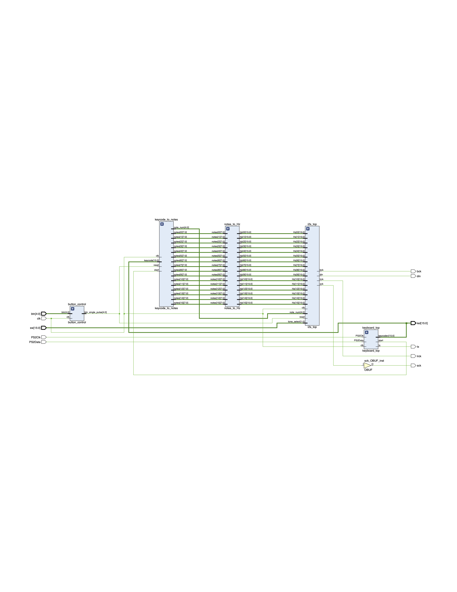
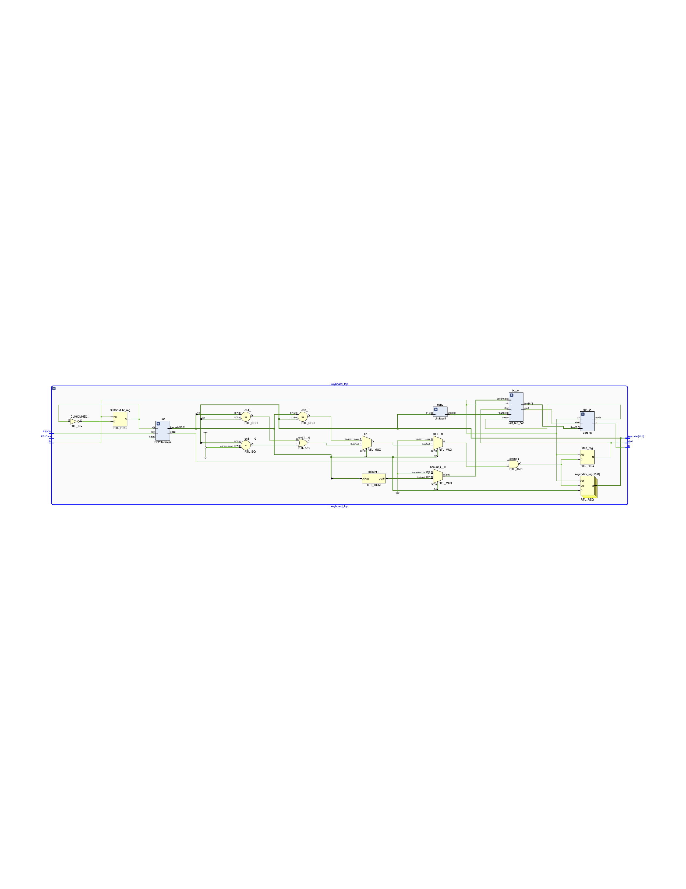
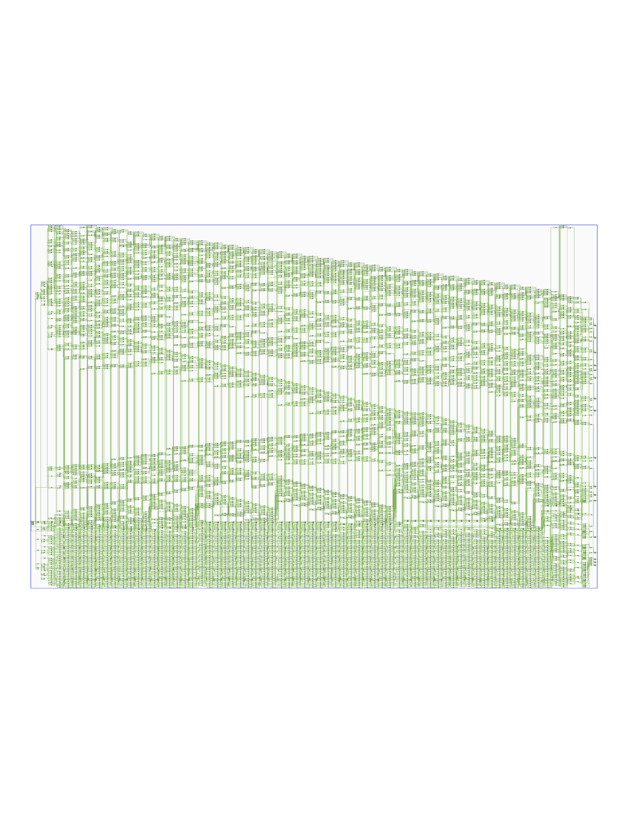
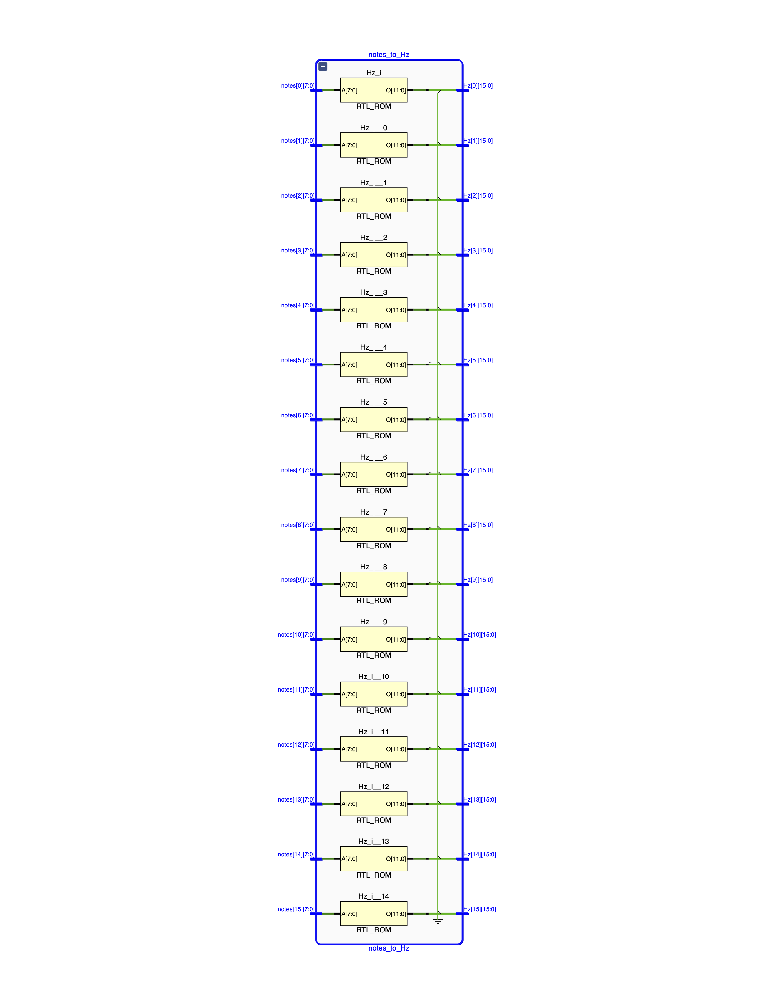
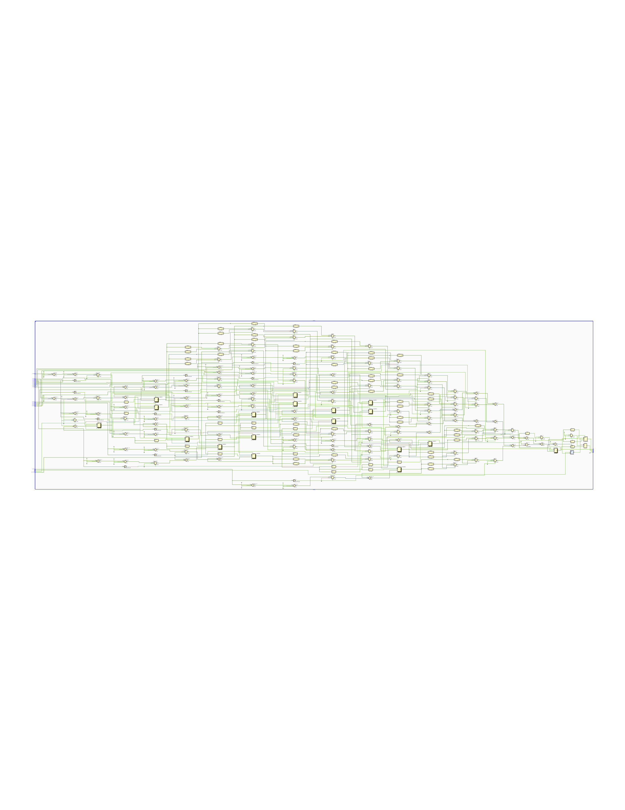

## Introduction

“Traditional instruments separate melody and harmony — I wanted to play both at once.”

MuPiano is a real-time digital piano implemented entirely on FPGA.
The idea came from my long-time fascination with music and electronic design. Traditional instruments like pianos or guitars are bound by mechanical structures — you can either play chords or melodies, but not truly both in free form. I wanted to build a new kind of instrument, one that lets me perform melody and harmony simultaneously with full control over sound synthesis.

The system is built with SystemVerilog on the Basys 3 (AMD Artix-7) FPGA board and implements a full audio pipeline from key input to DAC output.

Keyboard signals are processed in parallel through USB-HID protocols, then passed into a custom digital signal processing (DSP) module that supports multi-tone synthesis, tone importing, and unlimited polyphony within hardware limits.

An I²S audio interface transmits high-fidelity stereo sound to an external DAC, producing rich, low-latency audio (<5 ms).

Designing MuPiano taught me how to combine hardware engineering, digital signal processing, and musical creativity into a unified system.

When I play the keys, I know it’s not just an FPGA project — it’s the digital piano I dreamed of building.

## Schematics

<!-- figures/schematic_i2s_top.png
figures/schematic_keyboard.png
figures/schematic_keycode_to_notes.png
figures/schematic_notes_to_Hz.png
figures/schematic_top.png -->

### Schematic: Top Level

### Schematic: Keyboard Interface

### Schematic: Keycode to Notes

### Schematic: Notes to Frequency (Hz)

### Schematic: I2S Interface

